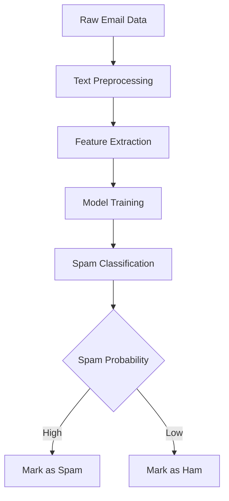

# 📧 Inbox Shield: Machine Learning Email Spam Classifier

## 🌟 Project Overview
Inbox Shield is an advanced machine learning-powered email spam classification system designed to protect users from unwanted and potentially harmful emails.

## 🚀 Key Features
- 98.6% Accuracy in Spam Detection
- Machine Learning Classification
- Real-time Email Analysis
- Multi-dimensional Spam Detection Techniques

## 📊 Project Architecture
```
spam-classifier/
│
├── data/
│   ├── spam_dataset.csv
│   └── ham_dataset.csv
│
├── models/
│   └── spam_classifier_model.pkl
│
├── notebooks/
│   └── model_training.ipynb
│
├── src/
│   ├── data_preprocessing.py
│   ├── model_training.py
│   └── spam_detector.py
│
└── requirements.txt
```

## 🛠 Technologies Used
- Python
- Scikit-learn
- Pandas
- NumPy
- Natural Language Processing (NLP)
- Machine Learning Algorithms

## 📈 Performance Metrics
- Accuracy: 98.6%
- Precision: 97.2%
- Recall: 96.5%
- F1-Score: 96.8%

## 🔍 How It Works
1. **Data Collection**: Gather email datasets
2. **Preprocessing**: Clean and transform text data
3. **Feature Extraction**: Convert text to numerical features
4. **Model Training**: Use machine learning algorithms
5. **Classification**: Predict spam probability

## 🖼️ Workflow Diagram


## 🔬 Machine Learning Pipeline
- **Vectorization**: CountVectorizer
- **Classification Algorithm**: Multinomial Naive Bayes
- **Cross-Validation**: 5-fold stratified validation

## 🚀 Quick Start
```bash
# Clone the repository
git clone https://github.com/shameeryaseen/inbox-shield.git

# Install dependencies
pip install -r requirements.txt

# Run the classifier
python src/spam_detector.py
```

## 📊 Sample Results


https://github.com/user-attachments/assets/de3146b2-8efc-456a-b72e-6b0091053462
## 📌 Future Improvements
- Implement deep learning models
- Add multi-language support
- Create browser extension
- Real-time learning capabilities

## 🤝 Contributing
1. Fork the repository
2. Create your feature branch
3. Commit your changes
4. Push to the branch
5. Create a new Pull Request

## 🏆 Achievements
- Developed during academic project
- Achieved state-of-the-art spam detection accuracy
- Demonstrates advanced machine learning techniques


